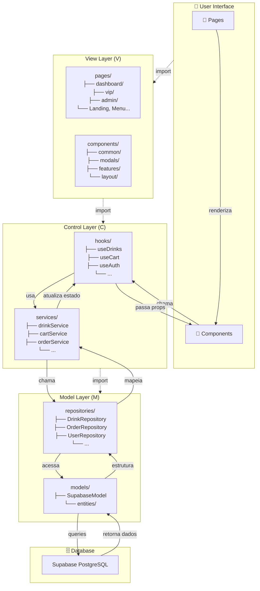

# 🏗️ Diagrama de Arquitetura MVC - EventDrink

## Fluxo Completo de Dados



## Estrutura de Pastas Detalhada

```
src/
│
├── 📄 App.tsx                 ← Entry component
├── 📄 main.tsx                ← Entry point
├── 🎨 index.css               ← Global styles
│
├── 📁 pages/                  ← V - Telas completas
│   ├── dashboard/
│   │   ├── DashboardPage.tsx
│   │   ├── DashboardFree.tsx
│   │   ├── DashboardVip.tsx
│   │   └── DashboardAdmin.tsx
│   ├── vip/
│   │   ├── VipClubPage.tsx
│   │   ├── VipRecipes.tsx
│   │   ├── VipVideos.tsx
│   │   └── VipDownloads.tsx
│   ├── admin/
│   │   ├── AdminDashboard.tsx
│   │   ├── AdminEvents.tsx
│   │   ├── AdminFinancial.tsx
│   │   └── AdminCourses.tsx
│   ├── LandingPage.tsx
│   ├── MenuPage.tsx
│   ├── CartPage.tsx
│   ├── ResultsPage.tsx
│   ├── ProfilePage.tsx
│   ├── HistoryPage.tsx
│   ├── HelpPage.tsx
│   └── ConfigPage.tsx
│
├── 🎨 components/             ← V - Componentes reutilizáveis
│   ├── common/
│   │   ├── Logo.tsx           ✓ Logo app
│   │   ├── SafeImage.tsx      ✓ Image com fallback
│   │   ├── ChatWidget.tsx     ✓ Chat support
│   │   └── Header.tsx         (template)
│   │
│   ├── modals/
│   │   ├── AgeGateModal.tsx   ✓ Verificação idade
│   │   ├── UserLoginModal.tsx ✓ Login
│   │   └── ConfirmModal.tsx   (template)
│   │
│   ├── features/
│   │   ├── DrinkCreator.tsx   ✓ Create drink
│   │   ├── MenuHarmonizer.tsx (mover)
│   │   ├── VIPLock.tsx        (mover)
│   │   └── ShoppingCart.tsx   (novo)
│   │
│   └── layout/
│       ├── MainLayout.tsx     (mover)
│       ├── AdminLayout.tsx    (mover)
│       └── VipLayout.tsx      (mover)
│
├── 🎮 controllers/            ← C - Orquestração
│   ├── AppController.ts       (existente)
│   ├── drinkController.ts     (novo)
│   ├── orderController.ts     (novo)
│   └── ...
│
├── ⚙️ services/               ← C - Lógica de negócio
│   ├── drinkService.ts        ✓ Bebidas
│   ├── cartService.ts         ✓ Carrinho
│   ├── orderService.ts        (template)
│   ├── userService.ts         (template)
│   ├── authService.ts         (template)
│   ├── adminService.ts        (template)
│   ├── couponService.ts       (template)
│   └── notificationService.ts (template)
│
├── 📦 repositories/           ← M - Acesso a dados
│   ├── DrinkRepository.ts     ✓ CRUD Drinks
│   ├── OrderRepository.ts     ✓ CRUD Orders
│   ├── UserRepository.ts      (template)
│   ├── AdminRepository.ts     (template)
│   ├── CouponRepository.ts    (template)
│   ├── ReviewRepository.ts    (template)
│   ├── StockRepository.ts     (template)
│   └── AuditLogRepository.ts  (template)
│
├── 🪝 hooks/                  ← React Custom Hooks
│   ├── useDrinks.ts           ✓ State drinks
│   ├── useCart.ts             ✓ State cart
│   ├── useUser.ts             (template)
│   ├── useAuth.ts             (template)
│   ├── useOrders.ts           (template)
│   ├── useAdmin.ts            (template)
│   └── useNotifications.ts    (template)
│
├── 🗄️ models/                ← M - Camada de dados
│   ├── SupabaseModel.ts       ← Database client
│   └── entities/              (tipos de entidade)
│
├── 🛠️ utils/                 ← Funções puras
│   ├── calculator.ts          (existente)
│   ├── validators.ts          (novo)
│   ├── formatters.ts          (novo)
│   └── helpers.ts             (novo)
│
├── 📦 constants/              ← Constantes
│   ├── translations.ts        (mover)
│   ├── config.ts              (novo)
│   └── enums.ts               (novo)
│
├── 📘 types/                  ← TypeScript types
│   ├── index.ts               (existente)
│   └── entities.ts            (novo)
│
├── 🎨 assets/                ← Recursos estáticos
│   └── images/
│
└── 📄 vite-env.d.ts
```

## Responsabilidades por Camada

### View Layer (Apresentação)
```
pages/         → Telas completas, roteamento
components/    → Componentes reutilizáveis (UI pura)
```
- ✅ O quê renderizar
- ❌ NÃO: Lógica de negócio

### Control Layer (Orquestração)
```
hooks/         → Estado e side effects React
services/      → Lógica de negócio
controllers/   → Coordenação
```
- ✅ Lógica de negócio
- ✅ Transformações de dados
- ❌ NÃO: Acesso direto ao banco

### Model Layer (Dados)
```
repositories/  → CRUD abstrato
models/        → Client de banco, entidades
```
- ✅ CRUD operations
- ✅ Queries ao banco
- ❌ NÃO: Lógica de negócio

## Exemplos de Fluxo

### Exemplo 1: Buscar Bebidas Recomendadas

```
DashboardPage.tsx
  ↓
  const { drinks, loading } = useDrinks('wedding')
  ↓
  useDrinks() Hook
    ↓
    DrinkService.getRecommendedDrinks()
    ↓
    DrinkRepository.getByEventType()
    ↓
    SupabaseModel.getDrinks()
    ↓
    Supabase (banco de dados)
    ↓
    (retorna para cima)
    ↓
    Hook atualiza estado
    ↓
  Component re-renderiza com drinks
```

### Exemplo 2: Adicionar ao Carrinho e Checkout

```
CartPage.tsx
  ↓
  const { items, addItem, checkoutCart } = useCart()
  ↓
  User clica "Checkout"
  ↓
  useCart() chama CartService.createOrderFromCart()
  ↓
  CartService faz validações
    - Valida carrinho
    - Calcula totais
    - Aplica descontos
  ↓
  CartRepository.create()
  ↓
  SupabaseModel.insertOrder()
  ↓
  Supabase (insere pedido)
  ↓
  OrderRepository retorna pedido criado
  ↓
  useCart atualiza estado (limpa carrinho)
  ↓
  Component renderiza sucesso
  ↓
  useNotifications pode chamar OrderService para notificar
```

### Exemplo 3: Editar Bebida (Admin)

```
AdminDashboard.tsx (page)
  ↓
  <DrinkCreator onSubmit={handleDrinkUpdate} /> (component)
  ↓
  User submete form
  ↓
  handleDrinkUpdate chama drinkController.updateDrink()
  ↓
  drinkController chama DrinkService.validateDrink()
  ↓
  DrinkService valida dados
  ↓
  drinkController chama DrinkRepository.update()
  ↓
  DrinkRepository chama SupabaseModel.updateDrink()
  ↓
  Supabase (atualiza bebida)
  ↓
  Dados atualizam no estado
  ↓
  Page renderiza bebida atualizada
```

## Padrões de Importação

### ✅ Correto (Respeitando Camadas)

```typescript
// Page importa Component + Hook
import DashboardContent from '@/components/layout/DashboardContent';
import { useDrinks } from '@/hooks/useDrinks';

// Component importa outro Component
import Button from '@/components/common/Button';
import Logo from '@/components/common/Logo';

// Hook importa Service
import { DrinkService } from '@/services/drinkService';

// Service importa Repository
import { DrinkRepository } from '@/repositories/DrinkRepository';

// Repository importa Model
import SupabaseModel from '@/models/SupabaseModel';
```

### ❌ Errado (Violando Camadas)

```typescript
// ❌ Component importando Service direto
import { DrinkService } from '@/services/drinkService';
const drinks = await DrinkService.getRecommendedDrinks();

// ❌ Page importando Repository
import { DrinkRepository } from '@/repositories/DrinkRepository';

// ❌ Component importando Model
import SupabaseModel from '@/models/SupabaseModel';

// ❌ Service importando View
import DashboardPage from '@/pages/dashboard/DashboardPage';
```

## Checklist de Qualidade

Ao criar novo arquivo, verificar:

### Pages
- [ ] Arquivo em `src/pages/` com sufixo `Page.tsx`
- [ ] Usa hooks, não services direto
- [ ] Renderiza components
- [ ] Trata loading e error states
- [ ] Props documentadas

### Components
- [ ] Arquivo em `src/components/[tipo]/`
- [ ] Componente puro (props only)
- [ ] Callbacks para eventos, não lógica
- [ ] NÃO faz chamadas a services
- [ ] Bem testável

### Services
- [ ] Arquivo em `src/services/`
- [ ] Sufixo `Service.ts`
- [ ] Lógica de negócio apenas
- [ ] Chama repositories, não models
- [ ] Funções puras ou bem isoladas
- [ ] Exporta objeto com métodos

### Repositories
- [ ] Arquivo em `src/repositories/`
- [ ] Sufixo `Repository.ts`
- [ ] CRUD + queries específicas
- [ ] Chama SupabaseModel apenas
- [ ] Mapping de dados em camada acima
- [ ] Exporta objeto com métodos

### Hooks
- [ ] Arquivo em `src/hooks/`
- [ ] Prefixo `use`
- [ ] Gerencia estado React
- [ ] Chama services, não repositories
- [ ] Retorna estado + funções
- [ ] Documentado com examples

---

**✅ Arquitetura pronta para escalar!**
